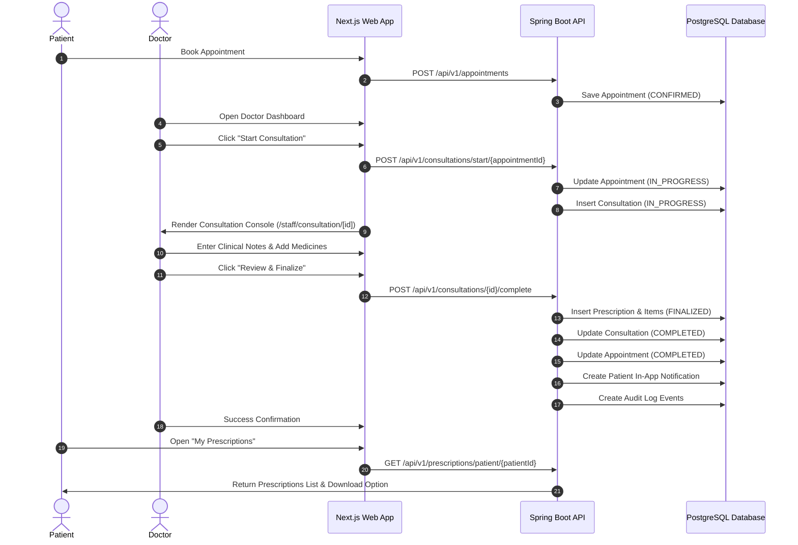

# Doctor Consultation & Medical Prescription Architecture

## Overview

CareFlow provides a complete, integrated Doctor Consultation, Clinical Notes, and Medical Prescription workflow.

- **Authoritative Data Layer**: PostgreSQL 16 with Flyway migration `V16__consultation_and_prescriptions.sql`.
- **State Machine Integration**: Integrates directly with the `Appointment` state machine (`CONFIRMED`/`CHECKED_IN` -> `IN_PROGRESS` -> `COMPLETED`).
- **Structured Prescriptions**: Multi-medicine prescription builder supporting dosage, route, frequency, duration, quantity, timing, and food instructions.
- **Strict RBAC & Ownership**: Patients can only view and download their own prescriptions; doctors can only start consultations and prescribe for assigned appointments.
- **Offline Printable Documents**: Built-in document generator serving clean HTML/text downloadable prescription documents.

---

## Workflow Sequence

---

## Database Schema (Flyway V16)

### `consultation` Table
- `consultation_id` UUID PRIMARY KEY
- `appointment_id` UUID NOT NULL UNIQUE REFERENCES appointment(appointment_id)
- `patient_id` UUID NOT NULL REFERENCES patient(patient_id)
- `doctor_id` UUID NOT NULL REFERENCES doctor(doctor_id)
- `chief_complaint`, `symptoms`, `clinical_notes`, `diagnosis`, `assessment`, `treatment_advice`, `follow_up_instructions`, `additional_notes` (TEXT)
- `follow_up_date` DATE
- `status` VARCHAR(32) NOT NULL DEFAULT 'IN_PROGRESS' (IN_PROGRESS, COMPLETED)
- `started_at`, `completed_at`, `created_at`, `updated_at` (TIMESTAMPTZ)

### `prescription` Table
- `prescription_id` UUID PRIMARY KEY
- `consultation_id` UUID NOT NULL UNIQUE REFERENCES consultation(consultation_id)
- `appointment_id` UUID NOT NULL UNIQUE REFERENCES appointment(appointment_id)
- `patient_id` UUID NOT NULL REFERENCES patient(patient_id)
- `doctor_id` UUID NOT NULL REFERENCES doctor(doctor_id)
- `prescription_number` VARCHAR(32) NOT NULL UNIQUE
- `diagnosis`, `doctor_advice` (TEXT)
- `follow_up_date` DATE
- `status` VARCHAR(32) NOT NULL DEFAULT 'FINALIZED'
- `created_at`, `updated_at` (TIMESTAMPTZ)

### `prescription_item` Table
- `prescription_item_id` UUID PRIMARY KEY
- `prescription_id` UUID NOT NULL REFERENCES prescription(prescription_id) ON DELETE CASCADE
- `medicine_name`, `dosage`, `frequency`, `duration` (VARCHAR - Required)
- `generic_name`, `route`, `quantity`, `food_instruction`, `timing`, `special_instructions` (Optional)

---

## REST API Contract

### Consultation Endpoints
- `POST /api/v1/consultations/start/{appointmentId}` (Doctor only)
- `GET /api/v1/consultations/{id}`
- `GET /api/v1/consultations/appointment/{appointmentId}`
- `PUT /api/v1/consultations/{id}` (Save draft)
- `POST /api/v1/consultations/{id}/complete` (Finalize consultation & prescription)

### Prescription Endpoints
- `GET /api/v1/prescriptions/{id}`
- `GET /api/v1/prescriptions/appointment/{appointmentId}`
- `GET /api/v1/prescriptions/patient/{patientId}`
- `GET /api/v1/prescriptions/doctor/{doctorId}`
- `GET /api/v1/prescriptions/{id}/download` (Downloadable HTML/PDF prescription document)

---

## Security & RBAC Enforcement

- **Patient Isolation**: Patients are restricted to retrieving only their own prescriptions. Attempting to query another patient's prescription ID or patient ID throws HTTP 403 Forbidden.
- **Doctor Assignment**: Doctors can only start consultations and finalize prescriptions for appointments explicitly assigned to them.
- **Double Completion Prevention**: Pessimistic database locks (`findByIdForUpdate`) and status state checks prevent concurrent or duplicate completion submissions.
